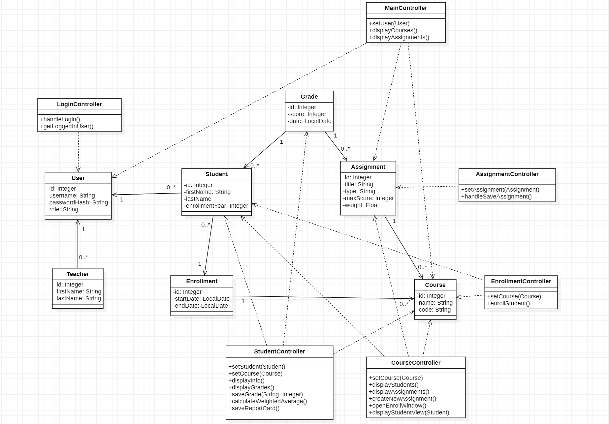

JaCoCo code coverage report hosted on [web disk](https://users.metropolia.fi/~sampokl/OhjelmistoTuotantoProjekti/jacoco/).  
Docker image hosted on [Docker Hub](https://hub.docker.com/repository/docker/gasdy/gradebook).  

# Gradebook and Report Card System

This program allows teachers to:
- Manage courses
- Add homework, exams, etc. for students in their courses
- Record and calculate student grades 
- Generate report cards based on their grades

# Technology Stack
- Java
- Maven
- Hibernate
- Jakarta
- SQL
- JaCoCo
- Jenkins
- Docker

## Architecture

### Use Case Diagram

Shows how teachers and students interact with the program

### ER Diagram

### Database schema

Shows the database structure with entities like Enrollment, Student, Grade, Teacher, Course and Assignment

### Class Diagram

### Sprint Reports

#### https://github.com/zakke-username/gradebook/tree/main/doc/Sprint%20reports

## How to Demo
To demo the application you are required to populate the application's database (running on the Docker container) manually. To populate database use newest version of sample-data.sql from [/database-SQL](/database-SQL)
